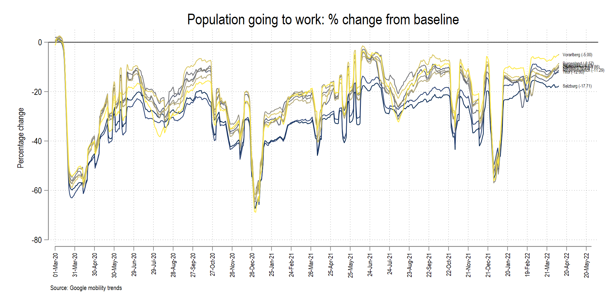
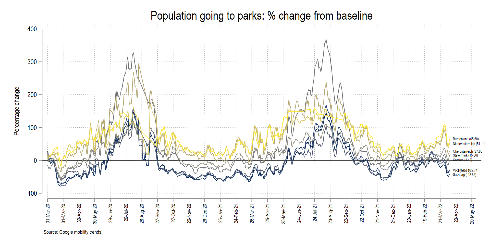
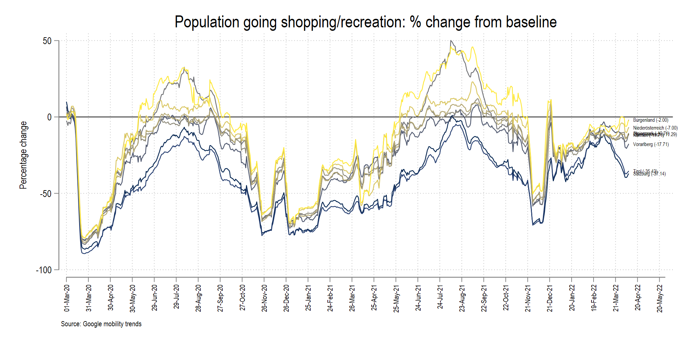
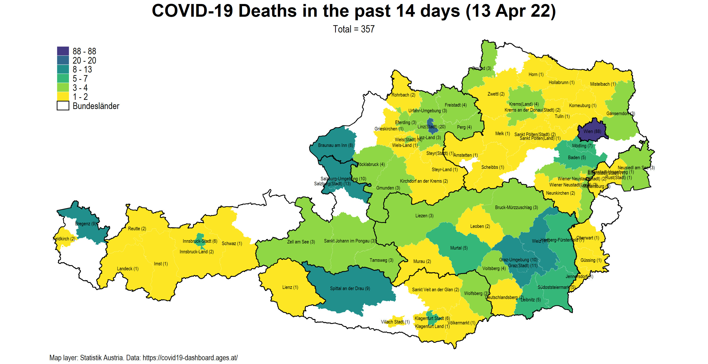
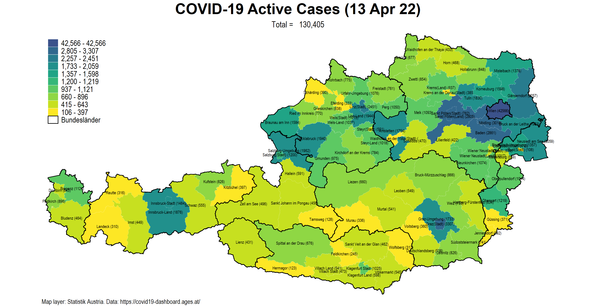

This page will still get more updates.

*Last updated: 13 July 2021*

# Intro

The aim of this repository is to, (a), archive the code that I was using to create daily COVID-19 maps and figures for Austria that were regularly posted on Twitter, and (b), provide some history and context to the data sharing process by Austrian authorities, what could have been done differently, and what can still be done.

# Files

The folder structure contains the following:

| Folder | Description | 
| --- | --- | 
| `dofiles` | Contains the Stata scripts that clean the data and generate the figures. |
| `figures` | Contains the visualizations. |
| `GIS` |     Contains the spatial files. |
| `master` |  Contains the final data files. |
| `raw` |     Contains the raw data. |
| `screenshots` | Contains some screenshots to supplement the information here.  |
| `temp` |    Contains the temporary intermediate files that convert raw data to master files. |

Please set the path to your master folder in the dofiles. In order to replicate the figures, please also install the [TSG Schemes](https://github.com/asjadnaqvi/Stata-schemes) and the *colorpalette* package `ssc install colorpalette, replace`. A basic knowledge of Stata is assumed. Files are annotated where necessary and might still be updated.

# Visualizations

The following dofiles generate the following figures:

[02_AT_cases_stringency_v5.do](./dofiles/02_AT_cases_stringency_v5.do)

[03_AT_mobility.do](./dofiles/03_AT_mobility.do)

[04_AT_hospitalization.do](./dofiles/04_AT_hospitalization.do)

[05_AT_maps_BZ_v5.do](./dofiles/05_AT_maps_BZ_v5.do)

# History

Here a brief background to the Tracker is provided. The Austrian COVID-19 tracker started off as a bunch of Tweets. This was mostly due to the fact that Austria went into a hard lockdown in March 2020, most of us were stuck at home, and there was little information out there. While Austria's data is now published regularly on the [AGES website](https://covid19-dashboard.ages.at/). This was not the case in the beginning of the pandemic. The data was original published as a table on the original https://info.gesundheitsministerium.at/ website (now completely redesigned): 

This had to be scraped daily. Additionally the website only had the map of Austrian provinces (9 in total), even though the website provided details for Bezirk-level information. So this started with copying down this information around the middle of March 2020 to create Bezirk (district) level maps. Since I was already working on another project where we had Bezirk-level data, including administrative boundaries from [Statistik Austria](https://statistik.at/web_de/statistiken/index.html), and a lot of scripts were in place, the setup cost for doing a COVID-19 Bezirk-level map was fairly low. 

## First stage: March to October 2020

The process of digitizing the data on the website and converting it into a machine-readable form was done daily from March till 6th October 2020. On this date, the website switched to AGES, which also eventually released all the old data in a CSV file. But before this information became public, the original website was updated at irregular intervals, sometimes hourly (mostly in the mornings) and sometimes every two to three hours (mostly in the evenings and the weekends). This was the beginning of the pandemic and testing was limited. This meant that the information was added on the website as it came in. 

My daily self-assigned duty was to copy the data after the 11 am update. This was done manually for quite some time directly for two reasons. First, the Bezirk-level data table was modified a few times. For example information for Vienna stopped being published at the Bezirk level (Vienna has 23 districts) and to date are only provided at the city level. While no official explanation has been given to why this is the case, the assumption here is that Vienna Bezirk-level data was considered too fine of a disaggregation and this was to anonymize the figures. 

Here is a map of the last detailed data point for Vienna from 25 March 2020:

Second, there were other changes made in the databases where region names were shuffled around. The daily manual activity helped keep these changes in check since we had no Bezirk identifiers to ensure merges were accurately done over time. For example, Gröbming was taken out and added to Liezen at one point to make it consistent with the latest boundaries.

The figure below shows the difference between the scrapped data and the official data. The match is quite close since there is little deviation from the 45 degree line:

## Second stage: October 2020 to June 2021

The second phase of the tracker, where the data switched to the AGES website, was fairly straightforward: automate the data download from the website, process the files, and make the maps and other figures. 

<blockquote class="twitter-tweet">
A major change in the <a href="https://twitter.com/hashtag/Austrian?src=hash&amp;ref_src=twsrc%5Etfw">#Austrian</a> <a href="https://twitter.com/hashtag/COVID19?src=hash&amp;ref_src=twsrc%5Etfw">#COVID19</a> dashboard that was recently taken over by <a href="https://twitter.com/hashtag/AGES?src=hash&amp;ref_src=twsrc%5Etfw">#AGES</a>. Data is no longer shown at the district level but complete time series is now available for cases and deaths at the district level. Could have released info on gender/age as well. <a href="https://twitter.com/hashtag/moredata?src=hash&amp;ref_src=twsrc%5Etfw">#moredata</a> <a href="https://t.co/irWZePdmId">pic.twitter.com/irWZePdmId</a>
&mdash; Asjad Naqvi (@AsjadNaqvi) <a href="https://twitter.com/AsjadNaqvi/status/1314132730901336064?ref_src=twsrc%5Etfw">October 8, 2020</a></blockquote> 

By this time several people, most notably [Eric Neuwirth](https://just-the-covid-facts.neuwirth.priv.at/), were making maps and figures daily in German to cater to the local audience. All local newspapers had also set up their own interactive visualizations. I had somewhat captured the international/expat community and my posts were also featured here and there. Most notably [Metropole](https://metropole.at/) picked these up a couple of times. I also recieved messages from random people for the maps, mostly internationals living in Vienna or parents of kids studying here. 

The data switch to AGES was not without hiccups. It was not clear when and how the information was updated. This was also the time when testing was scaling up, and information was coming in rapidly. This also had an impact on the visualizations. Figures changed considerably from one hour to the next, with data also back corrected, probably based on when the test samples were collected. This also caused considerable confusion since different numbers were popping up at the same time online. After some weeks, AGES (rightfully so) changed its strategy and started publishing data for the day earlier and with only one update at midnight to ensure the numbers were consistent. This was already standard practice for other larger countries like Germany and France which still have one or two day lags but back-corrections were rare.

This second phase was more experimental with testing out new visualizations, color schemes, and new graph types. At this point, there was little or no novelty in the daily updates. Most media outlets were reporting from their own platforms. I was personally more focused on finishing up the [European COVID-19 regional tracker](https://asjadnaqvi.github.io/COVID19-European-Regional-Tracker/) where the data expanded to the whole of Europe at the NUTS-3/NUTS-2 level. 

By December 2020, information was fairly standardized, and the biggest concern was vaccine roll-outs and the new virus variants. Around this time, Austria, like other European countries was eager to end the lockdown, especially after massive economic losses especially to private businesses. At the time of this update, the vaccinations are ramping up in Austria, but the Delta variant is also a cause of major concern. Some countries have already started showing signs of a fourth wave. Currently the numbers remain low for Austria but the media is hinting at tighter measure of the virus gets out of hand.

# Useful links

Here are several websites in Austria that collate information or display their own projects:

[Bundesministerium für Bildung, Wissenschaft und Forschung (BMBWF)](https://www.bmbwf.gv.at/)

[Austrian Corona Panel Project (ACPP)](https://viecer.univie.ac.at/coronapanel/)

[International Institute for Applied Systems Analysis (IIASA)](https://covid19.iiasa.ac.at/)

[TU Wien COVID-19 Simulation model](https://informatics.tuwien.ac.at/news/1873)

[Institut für Höhere Studien (IHS)](https://www.ihs.ac.at/about/public-relations/news/ihs-resources-covid-19/)

[Österreichisches Institut für Wirtschaftsforschung (WIFO)](https://www.wifo.ac.at/jart/prj3/wifo/main.jart?rel=de&content-id=1592280018229&reserve-mode=active)

[Erich Neuwirths COVID-19-Analysen](https://just-the-covid-facts.neuwirth.priv.at/)

[Corona Ampel](https://corona-ampel.gv.at/)

[Österreichische Akademie der Wissenschaften (ÖAW)](https://www.oeaw.ac.at/vid/research/covid-19research/covid-19-tracker/)

# Miscellaneous 

[Archive of tweets](ARCHIVE.md)

