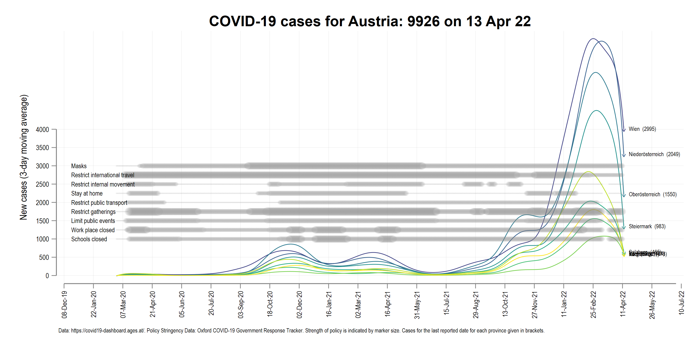
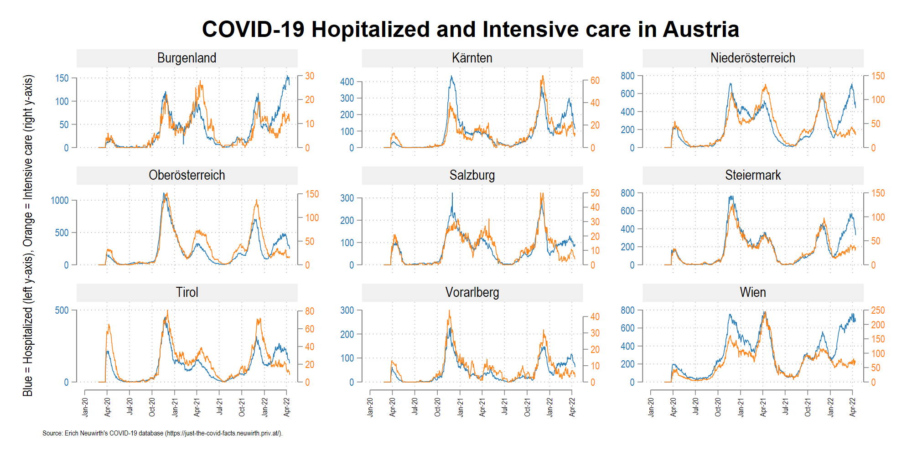
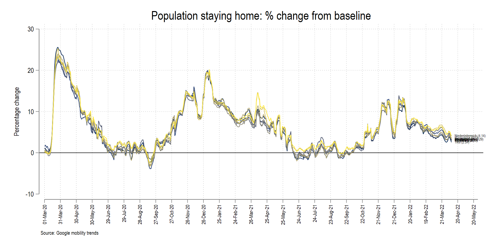

**THIS SITE IS UNDER CONSTRUCTION!**

Stuff is still moving around and being updated intermittently. Once complete, this website will be formally announced on social media.

*Last updated: 11 July 2021*

# Intro

The aim of the tracker is to archive the code that was used to create daily COVID-19 related maps and other figures on Twitter for Austria. Second is to provide some history and context to the whole data sharing process by Austrian authorities, what could have been done differently, and what can still be done.

# Files

The folder structure is as follows:

* `dofiles`: contain the Stata scripts to generate the figures
* `figures`: contains the visualizations
* `GIS`:     contains the spatial files
* `master`:  contains the final data files
* `raw`:     contains the raw data
* `screenshots`: contains some screenshots to display information here
* `temp`:    contains the temporary intermediate files that convert raw data to master files.

# Visualizations

The dofiles create the following figures:

## Line graphs

### Main figure

### Hospitalization and intensive care

### Mobility trends

## Maps

# History

This repository takes a look at the creation of Austria's COVID-19 tracker which started off as a bunch of tweets. This was started mostly due to the fact that Austria went into a lockdown phase in March 2020 and there was little information out there. This eventually expanded into a full-fledged project that is now the [COVID-19 Regional Tracker](https://asjadnaqvi.github.io/COVID19-European-Regional-Tracker/).

While Austria's data is now published regularly on the [AGES website](https://covid19-dashboard.ages.at/). This was not the case in the beginning of the pandemic. The data was original published as a table on the original https://info.gesundheitsministerium.at/ website (now completely redesigned): 

This had to be scraped daily. Additionally the website only had the map of Austrian provinces, even though the website provided details for Bezirk-level information. So all of this started with copying down this information around the middle of March 2020 to create Bezirk level maps. Since I was already working on Bezirk data for another project where we had collected other Bezirk-level data, including administrative boundaries from [Statistik Austria](https://statistik.at/web_de/statistiken/index.html), the setup cost for doing daily COVID-19 Bezirk-level maps was fairly low. 

## First stage: March to October 2020

The process of digitizing the data on the website and converting it into a machine-readable form was done daily from March till October 2020. After October 2020, the website switched to AGES which also released all the old statistics in a CSV file. But before this information became public, the original website was updated at irregular intervals, sometimes hourly (mostly in the mornings) and sometimes every two to three hours (mostly in the evenings). This was the beginning of the pandemic and testing was limited. This meant that the information was added on the website as it came in. 

My daily task was to copy the data after the 11 am update. This was done manually for quite some time for two reasons. First, the underlying data structure was modified a few times. For example information for Vienna stopped being published at the Bezirk level (Vienna has 23 districts) and to date are only provided at the city level. While no official explanation has been given to why this is the case, the assumption here is that Vienna Bezirk-level information is considered too fine of a disaggregation for the authorities. 

Here is a map of the last data point for Vienna:

Second, there were other changes made in the databases where region names were shuffled around. The daily manual activity helped keep these changes in check since we had no Bezirk idenfiers to ensure merges were accurately done over time. 

## Second stage: October 2020 to June 2021

The second phase of the tracker, where the data switched to the AGES website, was fairly straightforward: automate the data download from the website, process the files, and make the maps and other figures. 

<blockquote class="twitter-tweet">
A major change in the <a href="https://twitter.com/hashtag/Austrian?src=hash&amp;ref_src=twsrc%5Etfw">#Austrian</a> <a href="https://twitter.com/hashtag/COVID19?src=hash&amp;ref_src=twsrc%5Etfw">#COVID19</a> dashboard that was recently taken over by <a href="https://twitter.com/hashtag/AGES?src=hash&amp;ref_src=twsrc%5Etfw">#AGES</a>. Data is no longer shown at the district level but complete time series is now available for cases and deaths at the district level. Could have released info on gender/age as well. <a href="https://twitter.com/hashtag/moredata?src=hash&amp;ref_src=twsrc%5Etfw">#moredata</a> <a href="https://t.co/irWZePdmId">pic.twitter.com/irWZePdmId</a>
&mdash; Asjad Naqvi (@AsjadNaqvi) <a href="https://twitter.com/AsjadNaqvi/status/1314132730901336064?ref_src=twsrc%5Etfw">October 8, 2020</a></blockquote> 

By this time several people, most notably [Eric Neuwirth](https://just-the-covid-facts.neuwirth.priv.at/), were making maps and figures daily in German to cater to the local audience. All local newspapers had also set up their own interactive visualizations. I had somewhat captured the international/expat community and my visualizations were also featured here and there in local newspapers. Most notably Metropole picked these up a couple of times. I also recieved messages from random people, mostly internationals living in Vienna or parents of kids studying here. 

The data switch to AGES was not without hiccups. It was not clear when and how the information was updated. This was also the time when testing was scaling up, and information was coming in rapidly. This also had an impact on the visualizations. Figures changed considerably from one hour to the next, with data also being back corrected, probably based on when the test samples were collected. This also caused considerable confusion since different numbers were popping up at the same time. After some weeks, AGES (rightfully so) changed its strategy and started publishing data for the day earlier and with one update at midnight to ensure the numbers are consistent. This strategy was already fairly standard practice for other larger countries like Germany and France which still have one or two day lags by back-corrections are rarely.

This second phase was more experimental with testing out new visualizations, color schemes, and new graph types. At this point, there was little or no novelty in the daily updates. Most media outlets were reporting from their own platforms. I was personally more focused on finishing up the [European COVID-19 regional tracker](https://asjadnaqvi.github.io/COVID19-European-Regional-Tracker/) which also linked to other NUTS-level projects I was involved in. 

By December 2020, information was fairly standardized, and the biggest concern was vaccine roll-outs and the new virus variants. Austria, like other countries was eager to come put of the lock down, especially after the massive losses of not having a ski season.

# Useful links

OTHER PROJECTS FOCUSING ON AUSTRIA HERE.

